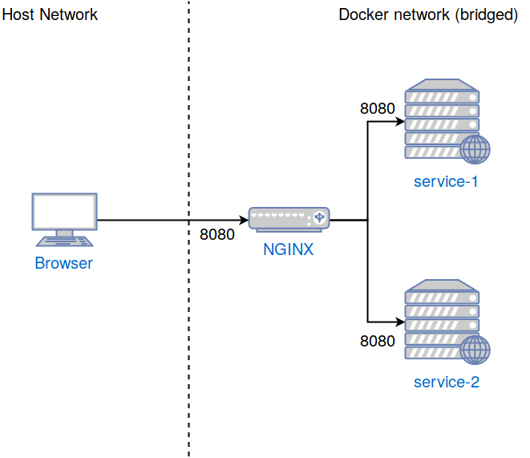

Load Balancing with Docker
==========================
This is a rudimentary example of how you can use Docker and Docker Compose to quickly set up a local test environment
to test a minimal cluster setup using round robin load balancing. In order to keep things as simple and short as possible, 
everything needed to test the example will be built locally, including the tiny webservice. For more details on how to 
build and run everything, see the information below.

Prerequisites
-------------
In order to build and run the example, you will need the following:
- [Docker](https://docs.docker.com/install/)
- [Docker-Compose](https://docs.docker.com/compose/install/)
- [Go 12+](https://golang.org/doc/install)

Running the Example:
--------------------
First, build the image using Docker (e.g. `docker build -t lb-example:master .`). 
This will build the webservice and package it up nicely in a Docker image. Next,
run the command `docker-compose up -d`. This will have Docker Compose create the local cluster for you. 
Now checkout your browser at localhost:8080 and hit refresh a couple of times. You should see two different
hex strings in alternating order. These strings are actually hostnames. 

Congratulations! You just set up a local cluster consisting of two web service nodes and a load balancer! 

High Level Overview
-------------------
The following picture will hopefully give you a better idea of what is actually going on:

How it works
------------
Let's step through this step by step, in order:

1. The build.sh script will call the go build command and pass it a few arguments, telling it to use the go
version of the http package in order to circumvent CGO and ensure that we'll actually end up with a binary
that will have no further library dependencies. 
2. The next step within the build script is the creation of the Docker image. This is fairly easy, since we
do have a statically linked binary with no further runtime dependencies (other than the kernel). So adding the
binary to the image and setting the appropriate entrypoint is all we need to do. The resulting image will be
tagged as "lb-example:1.0" - you can check this by using the command`docker images`.
3. The `docker-compose up -d` command will have Docker Compose look for a docker-compose.yml file in the current
directory. Using the specifications in there, it will set up the environment accordingly. The "-d" parameter
ensures that Docker Compose will be executed in the background. Note that only the port 8080 of our NGINX 
service is actually exposed. All other services will only be available on the internal (Docker) bridge network
that Docker Compose created for you. NGINX, however, is able to forward requests to those services, since it
is also part of the bridge network. That's all! No magic, just plain old Docker and Docker Compose. To learn
more about the details of how Docker works, I highly recommend the [Docker documentation](https://docs.docker.com/).